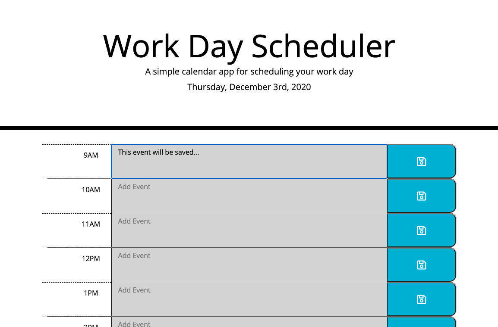

# Workday Scheduler

<span align="left">

<a href="https://img.shields.io/badge/License-MIT-brightgreen?style=plastic"></a>

 </span>



## Description

A work day scheduler, or daily planner, build by modifying some starter code and uses Third-Party APIs. 

View the application [here](https://dsmooke.github.io/workday-daily-planner/).

## Goals

- Create a simple calendar application that allows a user to save events for each hour of the day.
- This app with run in the browser and feature dnamically updated HTML and CSS powered by jQuery.
- Will utilize a library like [Moment.js](https://momentjs.com/) to work with dates and times.
  - If decide not to use Moment.js library, could utilize alternative libraries such as the following: [Luxon](https://moment.github.io/luxon/), [Day.js](https://day.js.org/), [date-fns](https://date-fns.org/), or [js-Joda](https://js-joda.github.io/js-joda/).
- Application loads with no errors.
- Application user experience is intuitive and easy to navigate.
- Application user interface style is clean and polished.
- Repository follows best practices for class/id naming conventions, indentation, quality comments, etc.

## Instructions

Our instructions for this assignment were based on the following user story and acceptance criteria:

### User Story

```
AS AN employee with a busy schedule
I WANT to add important events to a daily planner
SO THAT I can manage my time effectively
```

### Acceptance Criteria

```
GIVEN I am using a daily planner to create a schedule
WHEN I open the planner
THEN the current day is displayed at the top of the calendar
WHEN I scroll down
THEN I am presented with time blocks for standard business hours
WHEN I view the time blocks for that day
THEN each time block is color-coded to indicate whether it is in the past, present, or future
WHEN I click into a time block
THEN I can enter an event
WHEN I click the save button for that time block
THEN the text for that event is saved in local storage
WHEN I refresh the page
THEN the saved events persist
```

#### Definitions

_Third Party APIs:_ Third party APIs are located on third party servers. Third party APIs are APIs provided by third parties — generally companies such as Facebook, Twitter, or Google — to allow you to access their functionality via JavaScript and use it on your site. To access them from JavaScript you first need to connect to the API functionality and make it available on your page. This typically involves first linking to a JavaScript library available on the server via a <script> element,

_standard business hours:_ In the U.S., a business whose employees work Monday through Friday 9am to 5pm; this results in an 8 hour workday and a typical work-week of 40 hours.

_local storage:_ A JavaScript read-only property that allows you to access a storage object for the document's origin; the data stored is saved across browser sessions. Data stored in localStorage has no expiration time (data is not cleared when the page session ends, or closes). Data stored in localStorage is specific to the protocol of the page.

## Developer

For my workday daily scheduler I focused on a detailed html format, but later realized that would only complicate my JavaScript code. This assignment marked a mini milestone for myself because I managed to create both the root variable and the main 'for' loop on my own! Small accomplishment but made me feel like JavaScript is starting to click. Also, huge thank you to Nathan Sartain (TA) for his time and patience.

## Mock-Up

The following image shows the web application's appearance and functionality:


  
### Quick Installation

1. Clone repo and install packages. Edit scripts within package.json file. npm start to run in integrated terminal, run in browser with localhost:3000.

## Contributing

[Dana Smooke]("https://github.com/dsmooke")

## License

[MIT]("https://opensource.org/licenses/MIT")
---

© 2020 Trilogy Education Services, a 2U, Inc. brand. All Rights Reserved.
